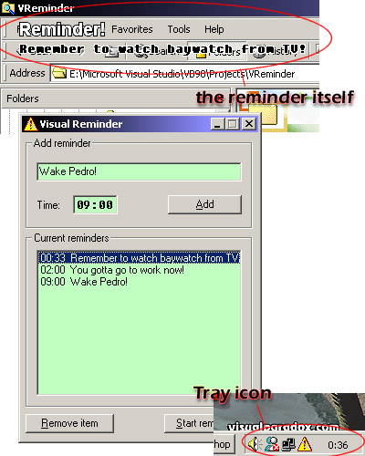



## Visual Reminder 1\.0

### Description

Visual Reminder is a must application for all users who keeps forgetting things.

Just add message and time (in 24h format) and it reminds you with a small wave and a message that will appeare in the corner of your screen. This message is blitted transparently in front of any application or desktop. (Screenshot included)

(Don't nag me about the mess it makes to your desktop :) No one is forcing you to test this lovely app)

Uses directX 7. Win 9x/2000 compatible.

Includes precompiled exe, in case of problems with compiling.
 
### More Info
 

             |
---                |---
**Submitted On**   |2001-01-12 00:25:04
**By**             |[Sami Riihilahti](https://github.com/Planet-Source-Code/PSCIndex/blob/master/ByAuthor/sami-riihilahti.md)
**Level**          |Advanced
**User Rating**    |4.5 (27 globes from 6 users)
**Compatibility**  |VB 5\.0, VB 6\.0
**Category**       |[Complete Applications](https://github.com/Planet-Source-Code/PSCIndex/blob/master/ByCategory/complete-applications__1-27.md)
**World**          |[Visual Basic](https://github.com/Planet-Source-Code/PSCIndex/blob/master/ByWorld/visual-basic.md)
**Archive File**   |[CODE\_UPLOAD136881112001\.zip](https://github.com/Planet-Source-Code/sami-riihilahti-visual-reminder-1-0__1-14357/archive/master.zip)

